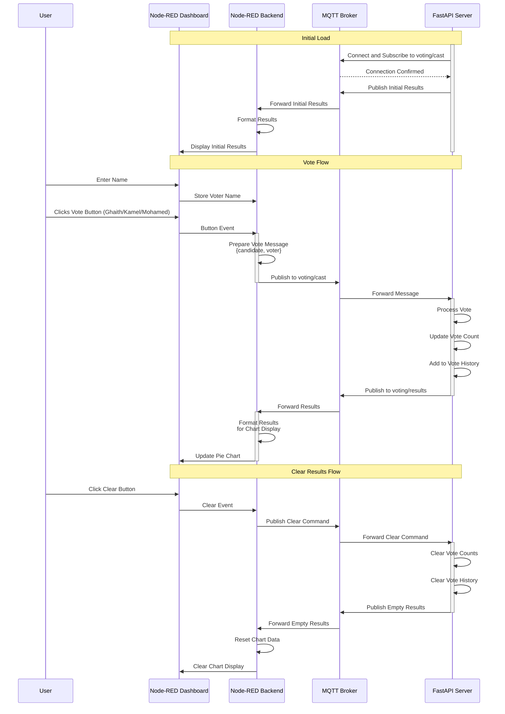

# Voting System

This project implements a voting system with MQTT and FastAPI and FlashMQ broker. It allows users to cast votes via MQTT
messages and provides a REST API for monitoring voting results. The results will be visualized dynamically using
Node-RED.

---

## Features

- **Real-Time Voting**: Votes are cast via MQTT messages, processed, and recorded dynamically.
- **Vote History**: Tracks the history of votes with voter information and timestamps.
- **Results Management**:
    - Publishes the updated voting results in real time.
    - Provides an option to clear all votes and reset the results.
- **REST API**: Exposes endpoints to retrieve current results and perform health checks.
- **MQTT Protocol**: Utilizes MQTT for communication with the voting system.

## System Architecture

The following sequence diagram shows how the components interact:



---

## Installation

Follow these steps to set up and run the server:

### Prerequisites

- Python 3.8+
- Virtual environment management tool (e.g., `venv`)
- MQTT broker (e.g., Mosquitto)
- `uvicorn` for running the FastAPI application

### Steps

1. **Clone the Repository**
   ```bash
   git clone https://github.com/ghaithsaidani/voting-app-node-red
   cd voting-app-node-red
   ```
2. **Building images and running required containers**
   ```bash
   docker-compose up
   ```

3. **Installing the requirements for the flask server**
   ```bash
   cd server
   ```
   ```bash
   python -m venv venv
   source venv/bin/activate
   ```
   ```bash
   pip install paho-mqtt fastapi uvicorn
   ```
4. **Running the server**
   ```bash
   uvicorn main:app --reload
    ```

5. **Import the flow to node-red**
   - Access Node-RED at [http://localhost:1880](http://localhost:1880)
   - Click on the menu in the top-right corner
   - Select "Manage Palette"
   - install those 3 plugin: `node-red-node-mqtt`, `node-red-dashboard`, `node-red-contrib-http-request`
   - Click on the menu in the top-right corner
   - Select "Import"
   - Click "Select a file to import"
   - Navigate to the `node-red-flows.json` file in the project
   - Click "Import"
   - Deploy the flow using the "Deploy" button
   - Access the dashboard at [http://localhost:1880/ui](http://localhost:1880/ui)

## API Endpoints

- `GET /results`: Retrieve current voting results
- `GET /health`: Check server health status

## MQTT Topics

- `voting/cast`: Topic for casting votes
- `voting/results`: Topic for receiving voting results updates

## License

This project is licensed under the MIT License - see the [LICENSE](LICENSE) file for details.

## Contributing

1. Fork the repository
2. Create a new branch for your feature
3. Commit your changes
4. Push to the branch
5. Create a Pull Request

## 🙌 Acknowledgment

This project was developed and maintained by me **Ghaith Saidani**. Contributions, suggestions, and feedback are welcome!