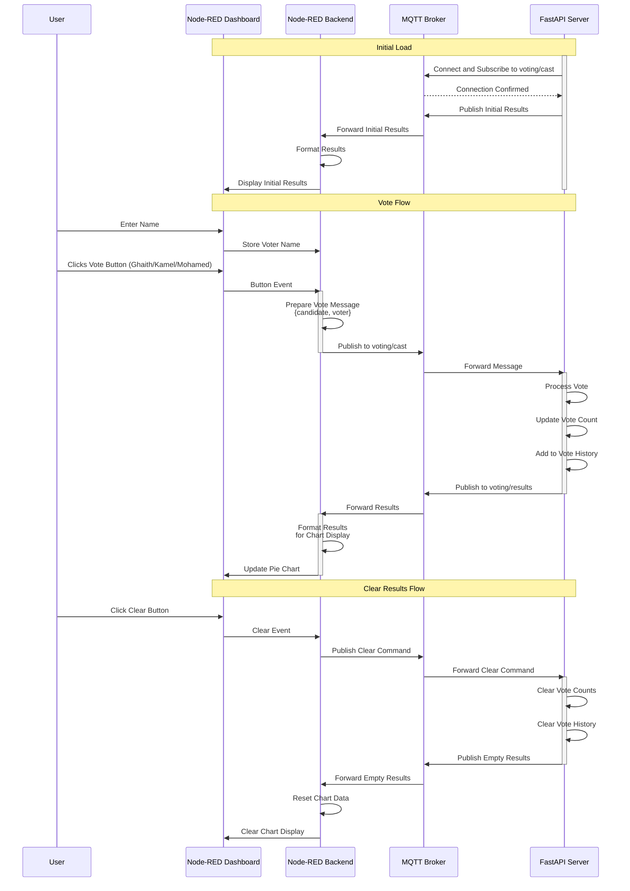

# Voting System

A real-time voting system built with FastAPI, MQTT, and Node-RED.

## System Architecture

The following sequence diagram shows how the components interact:

```mermaid
sequenceDiagram
    participant User
    participant Dashboard as Node-RED Dashboard
    participant NodeRED as Node-RED Backend
    participant Broker as MQTT Broker
    participant Server as FastAPI Server
    Note over Dashboard, Server: Initial Load
    activate Server
    Server ->> Broker: Connect and Subscribe to voting/cast
    Broker -->> Server: Connection Confirmed
    Server ->> Broker: Publish Initial Results
    Broker ->> NodeRED: Forward Initial Results
    NodeRED ->> NodeRED: Format Results
    NodeRED ->> Dashboard: Display Initial Results
    deactivate Server
    Note over Dashboard, Server: Vote Flow
    User ->> Dashboard: Enter Name
    Dashboard ->> NodeRED: Store Voter Name
    User ->> Dashboard: Clicks Vote Button (Ghaith/Kamel/Mohamed)
    Dashboard ->> NodeRED: Button Event
    activate NodeRED
    NodeRED ->> NodeRED: Prepare Vote Message<br>{candidate, voter}
    NodeRED ->> Broker: Publish to voting/cast
    deactivate NodeRED
    Broker ->> Server: Forward Message
    activate Server
    Server ->> Server: Process Vote
    Server ->> Server: Update Vote Count
    Server ->> Server: Add to Vote History
    Server ->> Broker: Publish to voting/results
    deactivate Server
    Broker ->> NodeRED: Forward Results
    activate NodeRED
    NodeRED ->> NodeRED: Format Results<br>for Chart Display
    NodeRED ->> Dashboard: Update Pie Chart
    deactivate NodeRED
    Note over Dashboard, Server: Clear Results Flow
    User ->> Dashboard: Click Clear Button
    Dashboard ->> NodeRED: Clear Event
    NodeRED ->> Broker: Publish Clear Command
    Broker ->> Server: Forward Clear Command
    activate Server
    Server ->> Server: Clear Vote Counts
    Server ->> Server: Clear Vote History
    Server ->> Broker: Publish Empty Results
    deactivate Server
    Broker ->> NodeRED: Forward Empty Results
    NodeRED ->> NodeRED: Reset Chart Data
    NodeRED ->> Dashboard: Clear Chart Display
```